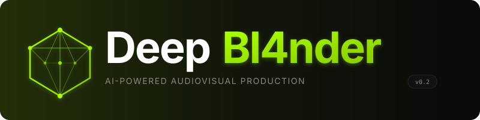
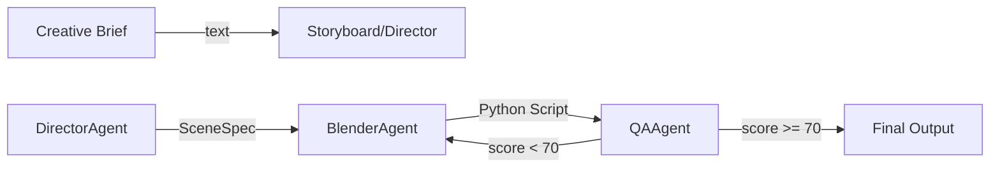

<p align="center">
  
</p>

<p align="center">
  <strong>AI-Powered 3D Production Pipeline</strong><br/>
  Transform text prompts into 3D scenes, animations, and videos with a multi-agent crew.
</p>

<p align="center">
  <a href="https://gayensis09.github.io/DeepBl4nder"></a>
  <a href="LICENSE"></a>
  
  
  
  
</p>

---

DeepBl4nder is a multi-agent 3D film production pipeline. You describe a scene in natural language — "a lone astronaut walking on Mars at sunset" — and a team of 14 specialized AI agents interprets your words, plans the narrative, designs the visual composition, generates Blender Python scripts, renders the output, and evaluates quality.

The LLM layer is a **cloud multi-provider router** built on [litellm](https://github.com/BerriAI/litellm). It aggregates Gemini, Groq, NVIDIA, OpenRouter, and Cloudflare, routes each request to an available provider, and handles failover, health tracking, and cooldowns automatically. No local model weights, no llama.cpp, no GPU requirement for inference.

The rendering layer is **Blender-first — the only host engine**. Generated `bpy` scripts run headless through the Blender bridge to produce Cycles/EEVEE renders and, via FFmpeg, composited video.

## How It Works

The pipeline transforms a creative brief through a sequence of stages, each handled by a specialized agent:



The StoryAgent and StoryboardAgent build narrative structure and visual language. The DirectorAgent synthesizes everything into a detailed `SceneSpec` — environment, characters, lighting, camera settings. The BlenderAgent generates deterministic Python code that constructs the entire 3D scene. The QAAgent evaluates the output, requesting revisions if quality falls below the threshold.

This is not a single monolithic AI. Each agent carries only the knowledge it needs — the StoryAgent never wastes context on rendering parameters, and the BlenderAgent never wastes tokens on dialogue structure.

## LLM Layer: Cloud Multi-Provider Router

DeepBl4nder does not run language models locally. Instead it aggregates several cloud LLM providers through a single litellm-based router:

| Provider   | Env variable                                       | Example models                                    |
| ---------- | -------------------------------------------------- | ------------------------------------------------- |
| Gemini     | `GEMINI_API_KEY`                                 | `gemini-3.6-flash`, `gemini-2.5-pro`          |
| Groq       | `GROQ_API_KEY`                                   | `gpt-oss-120b`, `qwen3.6-27b`                 |
| NVIDIA     | `NVIDIA_API_KEY`                                 | `nemotron-3.5-lightning`, `deepseek-v4`       |
| OpenRouter | `OPENROUTER_API_KEY`                             | `llama-3.3-70b-instruct`, `claude-3.5-sonnet` |
| Cloudflare | `CLOUDFLARE_API_KEY` + `CLOUDFLARE_ACCOUNT_ID` | `llama-3.3-70b-instruct`, `gemma-4-26b`       |

Key capabilities:

- **Model discovery** — each provider's `/models` endpoint is queried at router startup and filtered against explicit selection rules, so decommissioned or irrelevant models are never used.
- **Failover & fallback** — by default the router runs in `fallback` mode (try the first healthy provider, move down the pool on failure). `vote` mode queries every provider and uses majority agreement with health-based tie-breaking.
- **Health, cooldown, and budget** — per-provider success/failure counters, cooldown after an error, credential/usage-based error classification, and a per-production USD budget.
- **Backend-agnostic** — the router implements NOOA's `UnifiedLLM` interface, so the 14 agents share a single client and are insulated from provider details.

At least one provider API key is required. Configure keys in `.env` (see `.env.example`). The pool can be restricted via `DeepBl4nder_LLM_PROVIDERS` or `~/.deepbl4nder/llm.json`.

## Blender Engine

DeepBl4nder renders through a single, Blender-first pipeline:

- **Blender 4.1+** — the only host engine. Full `bpy` scripting, Cycles and EEVEE rendering, headless execution via the Blender bridge or Docker worker, and FFmpeg for compositing.

The BlenderAgent produces deterministic `bpy` scripts from the DirectorAgent's `SceneSpec`, validated by an AST validator before execution.

## Quick Start

### Prerequisites

- Python 3.12+
- Blender 4.1+ (for local rendering) or Docker (for the headless Blender worker)
- At least one cloud LLM API key (Gemini, Groq, NVIDIA, OpenRouter, or Cloudflare)

### Installation

```bash
git clone https://github.com/GAYENSIS09/DeepBl4nder.git
cd DeepBl4nder
pip install -e ".[tui]"
```

### Configure LLM providers

```bash
cp .env.example .env
# Edit .env and add at least one provider API key, e.g.:
#   GEMINI_API_KEY=...
#   GROQ_API_KEY=...
```

### Run the TUI

```bash
DeepBl4nder tui
```

The TUI wires the real agent crew in-process. Type a creative brief, press Enter, and watch the agents work.

### Docker (rendering worker)

```bash
docker compose up -d blender-worker
```

or with the optional TUI container:

```bash
docker compose --profile tui up -d
```

## CLI Commands

```bash
DeepBl4nder inspect              # Check environment, skills, plugins, workers
DeepBl4nder validate script.py   # Statically validate a Blender script
DeepBl4nder tui                  # Launch the terminal interface
pytest                           # Run the test suite
```

## Configuration

Environment variables (`.env` or shell):

```bash
# LLM providers (at least one required)
GEMINI_API_KEY=
GROQ_API_KEY=
NVIDIA_API_KEY=
OPENROUTER_API_KEY=
CLOUDFLARE_API_KEY=
CLOUDFLARE_ACCOUNT_ID=

# Router
DeepBl4nder_LLM_PROVIDERS=       # Optional pool restriction, comma-separated
DeepBl4nder_LLM_MODE=fallback    # "fallback" (default) or "vote"
DeepBl4nder_DISCOVER_MODELS=1    # Enable dynamic /models discovery

# Blender
BLENDER_EXE=blender              # Blender binary path

# Budget
DeepBl4nder_BUDGET=1.0           # Max USD per production
```

## Key Numbers

- **14** specialized AI agents
- **32** domain skills with progressive disclosure
- **1** rendering engine (Blender 4.1+, Cycles / EEVEE)
- **10** built-in plugins
- **5** supported cloud LLM providers (Gemini, Groq, NVIDIA, OpenRouter, Cloudflare)

## Contributing

See [CONTRIBUTING.md](CONTRIBUTING.md) for guidelines.

## Documentation

Full documentation is available at **[gayensis09.github.io/DeepBl4nder](https://gayensis09.github.io/DeepBl4nder)**.

## License

MIT License — see [LICENSE](LICENSE) for details.
