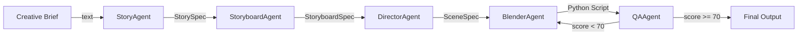
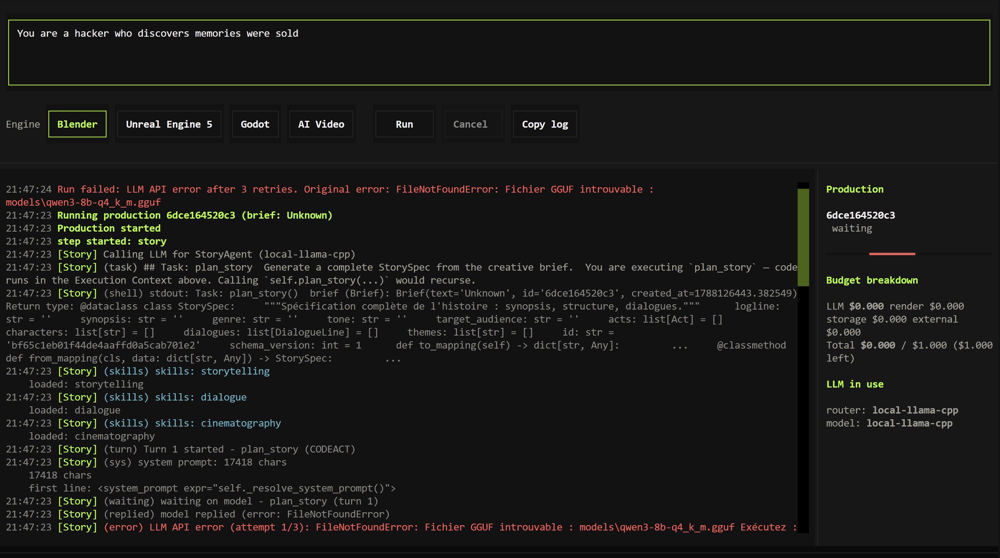
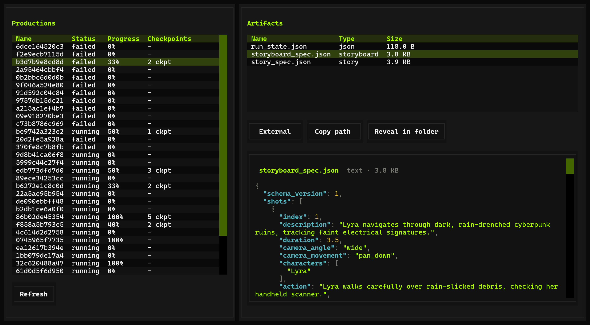
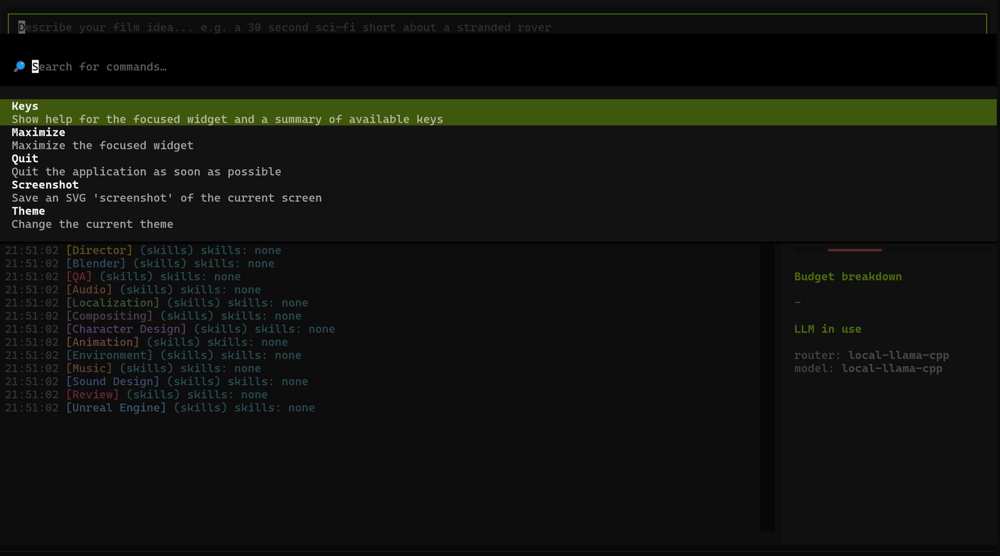
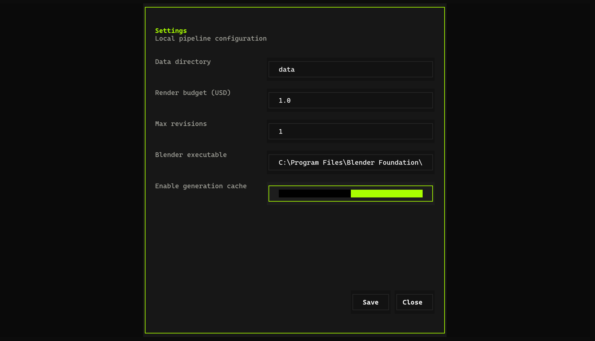
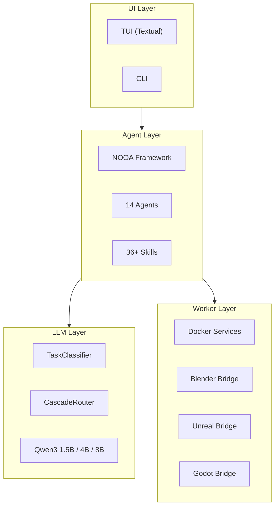

<p align="center">
  
</p>

<h1 align="center">DeepBl4nder</h1>

<p align="center">
  <strong>AI-Powered Local-First 3D Production Pipeline</strong><br/>
  Transform text prompts into 3D scenes, animations, and videos — entirely on your machine.
</p>

<p align="center">
  <a href="https://gayensis09.github.io/DeepBl4nder"></a>
  <a href="LICENSE"></a>
  
  
  
  
  
  
  
</p>

---

DeepBl4nder is a local-first multi-agent production system that runs entirely on your machine. You describe a scene in natural language — "a lone astronaut walking on Mars at sunset" — and a team of 14 specialized AI agents interprets your words, plans the narrative, designs the visual composition, generates Blender Python scripts, renders the output, and evaluates quality. No API keys. No cloud. Your data never leaves your workstation.

The system was designed around a simple conviction: creative AI should not depend on external services. When you write a story prompt, that prompt stays on your machine. When your GPU renders a frame, no telemetry leaves your workstation. The entire pipeline — from natural language understanding to 3D scene generation — runs locally, using open-weight models that you download once and use forever.

## How It Works

The pipeline transforms a creative brief through five stages, each handled by a specialized agent:



The StoryAgent reads your brief and extracts narrative structure — acts, beats, characters, and emotional arcs. The StoryboardAgent translates that narrative into visual language: shots, camera angles, movements, and transitions. The DirectorAgent synthesizes everything into a detailed SceneSpec — environment, characters, lighting, camera settings. The BlenderAgent generates deterministic Python code that constructs the entire 3D scene. And the QAAgent evaluates the output, requesting revisions if quality falls below the threshold.

This is not a single monolithic AI. Each agent carries only the knowledge it needs — the StoryAgent never wastes context tokens on rendering parameters, and the BlenderAgent never wastes tokens on dialogue structure. This specialization produces better output than any generalist model could.

## Screenshots

<p align="center">
  
</p>

<p align="center">
  
</p>

<p align="center">
  
</p>

<p align="center">
  
</p>

## Architecture

The system is organized in four layers, each with a clear responsibility:



At the bottom, Docker containers run the LLM server (llama.cpp with Qwen3 models) and the Blender worker (headless Blender 4.1 with FFmpeg). The LLM layer classifies tasks by complexity and routes them to the appropriate model — simple tasks go to the fast 1.5B model, complex code generation goes to the 8B model. The agent layer contains 14 specialized NOOA agents, each with its own set of skills loaded on-demand through progressive disclosure. And the UI layer provides a terminal interface where you type briefs and watch agents work in real-time.

## Local LLM: Zero API Costs

DeepBl4nder runs Qwen3 models locally through llama-cpp-python. The CascadeRouter implements a three-tier escalation strategy: simple classification tasks use the 1.5B model (~1.5GB VRAM), general reasoning uses the 4B model (~3GB), and complex code generation uses the 8B model (~5.5GB). A heuristic classifier runs in microseconds with zero token cost, routing each task to the optimal model. If a model fails, the system automatically escalates to the next heavier model.

This approach means your production costs are zero beyond the initial hardware investment. There are no API rate limits, no monthly subscriptions, and no data leaving your machine.

## Multi-Engine Support

The system supports four rendering targets, each behind a clean bridge interface:

- **Blender 4.1** — The primary engine. Full bpy scripting, Cycles and EEVEE rendering, headless Docker execution. Production-ready.
- **Unreal Engine 5** — Lumen global illumination, Nanite virtualized geometry, Movie Render Queue. Optional profile.
- **Godot 4** — GDScript execution, WebGL export, headless rendering. Optional profile.
- **AI Video** — Text-to-video via CogVideoX, image-to-video via SVD. Optional profile.

The bridge abstraction means you can switch engines without changing your workflow. The DirectorAgent produces a SceneSpec, and the appropriate bridge translates it into engine-specific commands.

## Quick Start

### Prerequisites

- Python 3.12+
- NVIDIA GPU with 8GB+ VRAM (for local LLM)
- Docker + NVIDIA Container Toolkit
- Blender 4.1+ (optional, for local runs)

### Installation

```bash
git clone https://github.com/GAYENSIS09/DeepBl4nder.git
cd DeepBl4nder
pip install -e ".[tui]"
```

### Download Models

```bash
python -m DeepBl4nder.llm.download --all
```

This fetches approximately 10GB of quantized GGUF model weights from HuggingFace. The download is resumable — interrupted downloads continue from where they left off.

### Launch Services

```bash
docker compose up -d
```

This starts the LLM server on port 8080 (llama.cpp with Qwen3-8B) and the Blender worker (headless Blender 4.1 + FFmpeg). Both containers have direct GPU access.

### Run the TUI

```bash
DeepBl4nder tui
```

The TUI connects to the Docker services through an in-process API. Type a creative brief, press Enter, and watch the agents work.

### Docker Profiles

```bash
docker compose up -d                          # Core only
docker compose --profile ue5 up -d            # + Unreal Engine 5
docker compose --profile godot up -d          # + Godot 4
docker compose --profile ai-video up -d       # + AI Video generation
```

## Local Development

```bash
pip install -e ".[tui,dev]"
python -m DeepBl4nder.llm.download --all
DeepBl4nder tui
```

The TUI starts the LLM server internally when Docker is not available. This is useful for development and testing.

## CLI Commands

```bash
DeepBl4nder inspect          # Check environment and GPU status
DeepBl4nder validate script.py  # Validate a Blender script
DeepBl4nder download --all   # Download all LLM models
DeepBl4nder tui              # Launch the terminal interface
pytest                       # Run the test suite
```

## Configuration

Environment variables (`.env` or shell):

```bash
# LLM
DeepBl4nder_MODELS_DIR=./models        # Where GGUF models are stored
DeepBl4nder_LLM_HOST=127.0.0.1         # LLM server host
DeepBl4nder_LLM_PORT=8080              # LLM server port

# Blender
BLENDER_EXE=/usr/local/bin/blender     # Blender binary path

# Budget
DeepBl4nder_BUDGET=1.0                 # Max USD per production

# TUI
DeepBl4nder_API_URL=http://localhost:8080  # For TUI to connect to LLM
```

## Key Numbers

- **14** specialized AI agents
- **36+** domain skills with progressive disclosure
- **3** local LLM models (1.5B, 4B, 8B)
- **4** rendering engines
- **10** built-in plugins
- **0** API keys required

## Contributing

See [CONTRIBUTING.md](CONTRIBUTING.md) for guidelines.

## Documentation

Full documentation is available at **[gayensis09.github.io/DeepBl4nder](https://gayensis09.github.io/DeepBl4nder)**.

## License

MIT License — see [LICENSE](LICENSE) for details.
